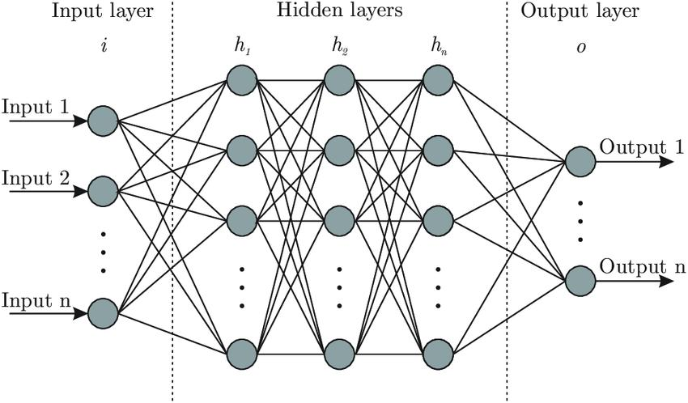

# Introduction

Neural networks, also known as artificial neural networks (ANNs) or simulated network (SNNs) are sub-set of machine learning and are heart of deep learning algorithms. A standard neural network (NN) consists odf many simple, connected processors called neuron , each producing a sequence of real valued activations. An artificial neuron recieves a signals and then processes them and can signal neurons connected to it.

ANNs are comprised of a node layers, containing an input layer, one or more hidden layers and an output layer. Each node or artificial neuron, connects to another has an associated weight and threshold. If the output of any individual node is above the specified threshold value, that node is activated, sending data to the next layer of the next layer of the network.

  

The aim of constructing ANNs is to create artificial intelligence inspired by the working of human brain, even though the latter is not yet fully understood. They are based on the computers and man's brain abilities. In a similar way, the main asset of neural network is the ability of their neurons to take part in an analysis while working simultaneously but independently from each other.Artificial neural networks are also good at analysing large sets of unlabeled, often high-dimensional data-where it may be difficult to determine a prior which questions are most relevant and rewarding to ask

The tools for machine learning with neural networks were developed long ago, most of them during the second half of the last century. In 1943, McCulloch and Pitts analysed how networks of neurons can process information.

# Application in biology

Computer technology has been advanced tremendously and the interest has been increased for the potential use of "Artificial Intelligence" in biology. ANNs use in biology seems to be an interseting field of research lately. Th application of this system in biology have a wide area. ANNs is used for the diagonis of different diseases in both palnt and animal caused due to different factors. The capacity of ANNs to analyze large amounts of data and detect patterns warrants application in analysis of medical images, calssification of tumors and prediction of survival have some how made easy resarch in biology.
