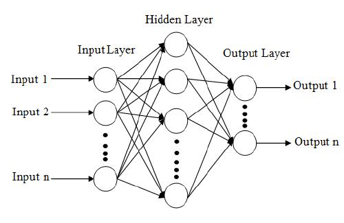

# Introduction

Neural networks, also known as artificial neural networks (ANNs) or simulated network (SNNs) are sub-set of machine learning and are heart of deep learning algorithms. A standard neural network (NN) consists odf many simple, connected processors called neuron , each producing a sequence of real valued activations. An artificial neuron recieves a signals and then processes them and can signal neurons connected to it.

ANNs are comprised of a node layers, containing an input layer, one or more hidden layers and an output layer. Each node or artificial neuron, connects to another has an associated weight and threshold. If the output of any individual node is above the specified threshold value, that node is activated, sending data to the next layer of the next layer of the network.

  

The aim of constructing ANNs is to create artificial intelligence inspired by the working of human brain, even though the latter is not yet fully understood. They are based on the computers and man's brain abilities. In a similar way, the main asset of neural network is the ability of their neurons to take part in an analysis while working simultaneously but independently from each other.Artificial neural networks are also good at analysing large sets of unlabeled, often high-dimensional data-where it may be difficult to determine a prior which questions are most relevant and rewarding to ask

The tools for machine learning with neural networks were developed long ago, most of them during the second half of the last century. In 1943, McCulloch and Pitts analysed how networks of neurons can process information.

# Application in biology

Computer technology has been advanced tremendously and the interest has been increased for the potential use of "Artificial Intelligence" in biology. ANNs use in biology seems to be an interseting field of research lately. Neural network has been applied widely in biology since the 1980s.Baldi and Brunak used application in biology to explain the theory of neural network.The spectrum of apllications of artificial neural network is very wide. ANNs is used for the diagonis of different diseases in both palnt and animal caused due to different factors. The capacity of ANNs to analyze large amounts of data and detect patterns warrants application in analysis of medical images, calssification of tumors and prediction of survival have some how made easy resarch in medical biology.

  

Neural networks have also been actively used in many bioinformatics applications such as DNA sequence, prediction, protein secondary structure prediction, gene expresssion profiles classification and analysis of gene expression patterns. The concepts of neural network used in pattern classification and signal processing gene procesing have been sucessfully applied in bioinformatics. Neural Likewise, in medical science ANNs have been extensively applied in diagosis, electronic signal analysis, radiology etc. ANNs have been used by many authors for clinical reserach. Application of ANNs are increasing in medical data mining. In agriculture Artififcial neural networks are one of the most popular tools for high production efficiency combined with a high quality products. ANNs can replace the classical methods of modelling many issuses, and are one of the main alternatives to classical mathematical models.networks have also been applied to the analysis of gene expression patterns as an alternative to hierarchial cluster methods. Neural networks have been used in agriculture for selection of appropriate net of plant during sudden and quick changes of environmental condition and predict the result of it. 

Likewise, in medical science ANNs have been extensively applied in diagosis, electronic signal analysis, radiology etc. ANNs have been used by many authors for clinical reserach. Application of ANNs are increasing in medical data mining. In agriculture Artififcial neural networks are one of the most popular tools for high production efficiency combined with a high quality products. ANNs can replace the classical methods of modelling many issuses, and are one of the main  alternatives to classical mathematical models. For a long time now, researchers from all over the world have been using thes tools to support agricultural production, making it more efficient and providing the highest quality products possible.  

# Multi-layer Neural Network

A multi-layer neural network contains more than one layer of artificial neurons or nodes. They differ widely in design. It is important to note that while single-layer neural networks were useful early in the evolution of AI, the vast majority of networks used today have a multi-layer model.

  

Multi-layer neural networks can be set up in numerous ways. Typically, they have at least one iput layer, which send weighted inputs series of hidden layers, and an output layer at the end. These more sophisticated setups are also assosicated with nonlinear builds using sidmoids and other function to direct the firing or activation of artificial neurons. A fully connected multi-layer neural network is called as  Multilayer Perceptron(MLP). In above figure we have one hidden layer including one input layer and one output layer.  An MLP is a typical example of feedforward artificial neural network.

The number of layers and the number of neurons are reffered to as hyperparameters of a neural network and these need tuning. Cross validation techniques must be used to find ideal values. An example of a multi-layer is shown in figure. It contains a layer of n input neuron $I_{i}$ (i = 1,...,n), a hidden layer( $H_{m}$ ) of m neuron on $H_{j}$ with the activation function $f_{Hj}$ (j = 1,...,m) and output layer of n neuron $O_{k}$ with the activation function $f_{Ok}$ (k = 1,....,n). The activation functions can be different for different layers. The connection between the neurons are weighed with different values, $v_{ij}$ are the weights between the hidden layer and the output layer. Using these weights, the networks propagates the external signal through the layers prodeucing the output signal which is of the form $I_{i}$. 

$$O_{k} = f_{ok}(net_{ok}) = f_{ok}\left(\sum_{j=1}^{m+1} w_{kj} f_{h} (net_{Hj}\right) = f_{ok}\left(\sum_{j=1}^{m+1} w_{kj} f_{Hj} \left(\sum_{i=1}^{n+1} v_{ji}I_{i}\right)\right)$$

This type of ANN, which simply propagates the input through all the layers, is called a feed-forward multi-layer ANN. The example discussed here contains only oner hideen layer. The network architecture can be extended to contain as many hidden layer as necessary.

### ANN learning

The learning process for an ANN is the process through which the weights of the network are determined. This is achieved by adjusting the weights until the certain criteria are satisfied. The ANN is presented with a training dataset which contains the input vector and a target associated with each input vector. The target is the desired output. The weights of the ANN are adjusted iteratively such taht the difference between the actual output of the ANN and the target is minimized. The most common supervised learning method is based on the gradient descent learning rule. The method optimises the network weights such that a certain objective function E is minimized by calculating the gradient of E in the weight space and moving the weight vector along the negative gradient. The binary crossentropy (BCE) is used for training. The BCE calculates the loss by computing the following average:

$$Loss = -\frac{1}{N}\sum_{i}^{N}O_{i} . log \hat{O} + (1-O_{i})log(1-\hat{O_{i}})$$

where $O{^}_{i}$ is the i-th scalar value in the output, $O_{i}$ is the corresponding target value, and N is the number of scalar values in the model output. For each iteration (usually called epoch), the gradient descent weight optimisation contains two phases:
* feed-forward pass in which the output of the network is calculated with the current value of the weights, activation function and bias
* backward propagation in which the errors of the output signal are propagated back from the output layer towards the input layer and the weights are adjusted as a function of the back-propagated errors.

to summarise, the supervised learning process implies the following steps:
(i) initialisation of the weights 
(ii) initialisation of the loss functions.
(ii)

